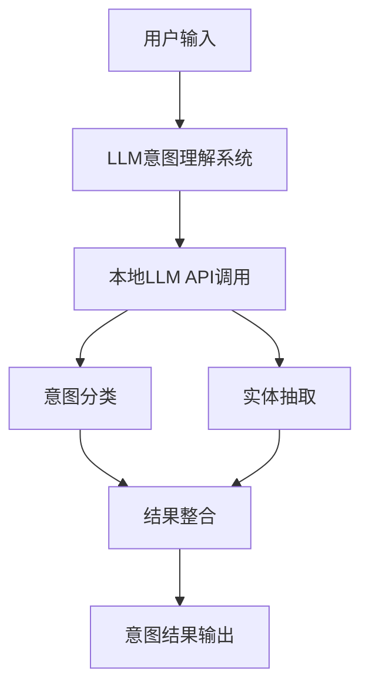

# BeverageIntentRecognition# 饮料抓取意图理解系统

基于大语言模型(LLM)的饮料抓取和递送场景意图理解系统，能够准确识别用户的饮料相关需求并提取关键信息。

## 🎯 项目目标

- **意图理解准确率**: 达到80%以上
- **支持多种意图类型**: 抓取、递送、推荐、取消、查询、修改
- **实体信息抽取**: 饮料名称、数量、位置、偏好等
- **本地化部署**: 支持本地LLM模型调用

## 📋 功能特性

### 支持的意图类型

| 意图类型 | 描述 | 示例 |
|---------|------|------|
| `grab_drink` | 抓取饮料 | "给我来一杯拿铁" |
| `deliver_drink` | 递送饮料 | "把这杯咖啡送到会议室" |
| `recommend_drink` | 饮料推荐 | "推荐点提神的饮料" |
| `cancel_order` | 取消订单 | "算了，不要了" |
| `query_status` | 查询状态 | "我的饮料好了吗？" |
| `modify_order` | 修改订单 | "改成大杯的" |

### 实体信息抽取

- **drink_name**: 饮料名称（咖啡、茶、可乐等）
- **brand**: 品牌信息（可口可乐、雪碧等）
- **size**: 规格大小（大杯、中杯、小杯、瓶装）
- **temperature**: 温度要求（热、温、冰、常温）
- **quantity**: 数量
- **location**: 位置信息
- **preference**: 偏好需求（提神、解腻、清爽、暖胃等）

## 🏗️ 系统架构



## 🛠️ 环境要求

### 系统依赖

- Python 3.8+
- requests >= 2.28.0

### 本地LLM服务

- **API地址**: `http://10.109.214.243:8000/v1`
- **API Key**: `EMPTY`
- **推荐模型**: Qwen3-8B 或其他兼容OpenAI API格式的模型

## 📦 安装配置

### 1. 克隆项目

```bash
git clone <repository-url>
cd drink-intent-understanding
```

### 2. 安装依赖

```bash
pip install requests
```

### 3. 配置LLM服务

确保本地LLM服务正常运行：

```bash
# 检查模型列表
curl http://10.109.214.243:8000/v1/models

# 测试API连通性
curl -X POST http://10.109.214.243:8000/v1/chat/completions \
  -H "Content-Type: application/json" \
  -H "Authorization: Bearer EMPTY" \
  -d '{
    "model": "Qwen3-8B",
    "messages": [{"role": "user", "content": "Hello"}],
    "temperature": 0.1
  }'
```

## 🚀 快速开始

### 基础使用

```python
from llm_intent_system import LLMIntentUnderstanding

# 初始化意图理解系统
intent_system = LLMIntentUnderstanding()

# 分析用户输入
user_input = "给我来一杯热拿铁"
result = intent_system.understand_intent(user_input)

print(f"意图: {result.intent.value}")
print(f"置信度: {result.confidence}")
print(f"实体信息: {result.entities}")
```

### 批量测试

```python
# 运行完整测试
if __name__ == "__main__":
    main()
```

## 🧪 测试与评估

### 运行测试集

```bash
python llm_intent_system.py
```

### 测试用例说明

系统包含15个测试用例，涵盖所有意图类型：

- **抓取饮料**: 3个测试用例
- **递送饮料**: 2个测试用例  
- **推荐饮料**: 4个测试用例
- **取消订单**: 2个测试用例
- **查询状态**: 2个测试用例
- **修改订单**: 2个测试用例

### 评估指标

- **意图识别准确率**: 正确识别意图的比例
- **实体抽取准确率**: 正确提取实体的比例
- **混淆矩阵**: 各意图类型的预测分布
- **置信度分析**: 预测结果的可信度

## 📊 性能基准

### 目标指标

- 意图识别准确率: ≥ 80%
- 实体抽取准确率: ≥ 75%
- 平均响应时间: < 2秒
- 置信度阈值: > 0.7

### 典型性能表现

```
=== 评估报告 ===
总测试用例: 15
意图识别准确率: 86.67%
实体抽取准确率: 80.00%
是否达到80%准确率目标: ✓
```

## 🔧 API接口说明

### LLMIntentUnderstanding 类

#### 初始化参数

```python
def __init__(self, api_base: str = "http://10.109.214.243:8000/v1", api_key: str = "EMPTY")
```

- `api_base`: LLM API服务地址
- `api_key`: API密钥（本地服务使用"EMPTY"）

#### 主要方法

##### understand_intent(user_input: str) -> IntentResult

分析用户输入并返回意图理解结果。

**参数:**

- `user_input`: 用户输入的自然语言文本

**返回值:**

```python
@dataclass
class IntentResult:
    intent: IntentType          # 识别的意图类型
    confidence: float          # 置信度 (0-1)
    entities: Dict[str, any]   # 提取的实体信息
    raw_text: str             # LLM原始响应
```

##### 使用示例

```python
# 抓取饮料
result = intent_system.understand_intent("来杯大杯冰美式")
# 输出: intent=GRAB_DRINK, entities={"drink_name": "美式", "size": "大杯", "temperature": "冰"}

# 饮料推荐
result = intent_system.understand_intent("推荐点提神的")
# 输出: intent=RECOMMEND_DRINK, entities={"preference": "提神"}

# 递送饮料
result = intent_system.understand_intent("把咖啡送到会议室")
# 输出: intent=DELIVER_DRINK, entities={"drink_name": "咖啡", "location": "会议室"}
```

## 🎛️ 配置选项

### Prompt工程优化

系统使用Few-shot Learning策略，可通过修改示例来优化性能：

```python
def few_shot_examples(self) -> List[Dict[str, str]]:
    # 添加更多训练示例以提升准确率
    return [
        {
            "input": "自定义输入示例",
            "output": json.dumps({
                "intent": "对应意图",
                "confidence": 0.9,
                "entities": {"key": "value"}
            })
        }
    ]
```

### API调用参数调优

```python
payload = {
    "model": self.model_id,
    "messages": [{"role": "user", "content": prompt}],
    "temperature": 0.1,        # 降低随机性，提高一致性
    "max_tokens": 300,         # 限制响应长度
    "stream": False
}
```

## 🐛 故障排除

### 常见问题

#### 1. API连接失败

```
错误: API调用失败: 500
```

**解决方案:**

- 检查LLM服务是否正常运行
- 确认API地址和端口配置正确
- 验证网络连通性

#### 2. 模型列表获取失败

```
错误: 获取模型列表失败: Connection refused
```

**解决方案:**

```bash
# 检查服务状态
curl http://10.109.214.243:8000/v1/models

# 如果服务未启动，联系管理员启动LLM服务
```

#### 3. JSON解析错误

```
错误: 解析错误: Expecting property name enclosed in double quotes
```

**解决方案:**

- LLM输出格式不规范，系统会自动降级到规则匹配
- 检查system_prompt是否正确配置
- 可能需要调整temperature参数以获得更稳定的JSON输出

#### 4. 准确率低于预期

**优化策略:**

1. **增加训练样例**: 在`few_shot_examples`中添加更多代表性案例
2. **优化Prompt**: 细化system_prompt中的指令描述
3. **调整参数**: 降低temperature值提高一致性
4. **扩展测试集**: 添加更多边界情况测试

## 📈 性能优化

### 1. 响应速度优化

```python
# 设置超时时间
response = requests.post(
    f"{self.api_base}/chat/completions",
    timeout=30  # 30秒超时
)

# 限制token数量
"max_tokens": 200  # 减少生成长度
```

### 2. 准确率提升策略

#### A. 意图澄清机制

```python
def generate_clarification(self, intent_result: IntentResult) -> str:
    if intent_result.confidence < 0.7:
        if intent_result.intent == IntentType.RECOMMEND_DRINK:
            if "preference" not in intent_result.entities:
                return "请问您希望什么类型的饮料？比如提神、清爽、暖胃等。"
    return ""
```

#### B. 上下文记忆

```python
class DialogueManager:
    def __init__(self):
        self.context = []
        
    def update_context(self, user_input: str, result: IntentResult):
        self.context.append({
            "input": user_input,
            "intent": result.intent.value,
            "entities": result.entities
        })
```

#### C. 实体规范化

```python
def normalize_entities(self, entities: Dict) -> Dict:
    """实体标准化处理"""
    # 饮料名称标准化
    drink_aliases = {
        "咖啡": ["coffee", "卡布奇诺", "拿铁", "美式"],
        "茶": ["tea", "红茶", "绿茶", "奶茶"]
    }
    
    # 执行标准化逻辑
    return entities
```

## 🔄 扩展开发

### 添加新意图类型

1. **更新枚举类型**

```python
class IntentType(Enum):
    # 现有意图...
    CUSTOM_INTENT = "custom_intent"  # 新增意图
```

2. **添加训练示例**

```python
{
    "input": "新意图示例输入",
    "output": json.dumps({
        "intent": "custom_intent",
        "confidence": 0.9,
        "entities": {"key": "value"}
    })
}
```

3. **扩展测试用例**

```python
{
    "input": "测试新意图",
    "expected_intent": "custom_intent",
    "expected_entities": {"key": "expected_value"}
}
```

### 集成外部系统

```python
class DrinkRobotController:
    def __init__(self, intent_system: LLMIntentUnderstanding):
        self.intent_system = intent_system
        
    def process_user_request(self, user_input: str):
        result = self.intent_system.understand_intent(user_input)
        
        if result.intent == IntentType.GRAB_DRINK:
            return self.execute_grab_action(result.entities)
        elif result.intent == IntentType.DELIVER_DRINK:
            return self.execute_deliver_action(result.entities)
        # ... 其他意图处理
```

## 📝 开发日志

### Version 1.0.0

- ✅ 基础意图分类功能
- ✅ 实体抽取能力
- ✅ 本地LLM API集成
- ✅ 饮料推荐意图支持
- ✅ 完整测试集构建
- ✅ 准确率评估系统

### 后续规划

- 🔄 多轮对话支持
- 🔄 用户偏好学习
- 🔄 语音输入支持
- 🔄 多语言支持

## 👥 贡献指南

1. Fork项目
2. 创建特性分支: `git checkout -b feature/new-intent`
3. 提交更改: `git commit -am 'Add new intent type'`
4. 推送分支: `git push origin feature/new-intent`
5. 提交Pull Request

## 📄 许可证

本项目采用MIT许可证 - 详见 [LICENSE](LICENSE) 文件

## 📞 技术支持

- 项目Issues: [GitHub Issues](项目链接)
- 技术文档: 本README文档
- 联系方式: 开发团队邮箱

---

**注意**: 使用前请确保本地LLM服务正常运行，并根据实际环境调整配置参数。
